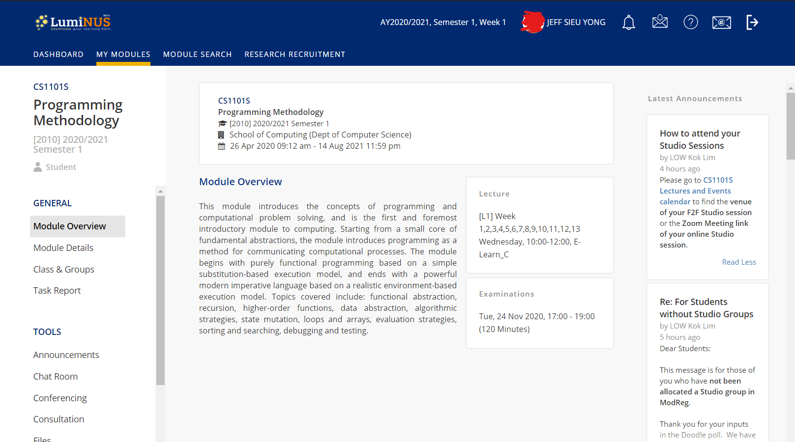
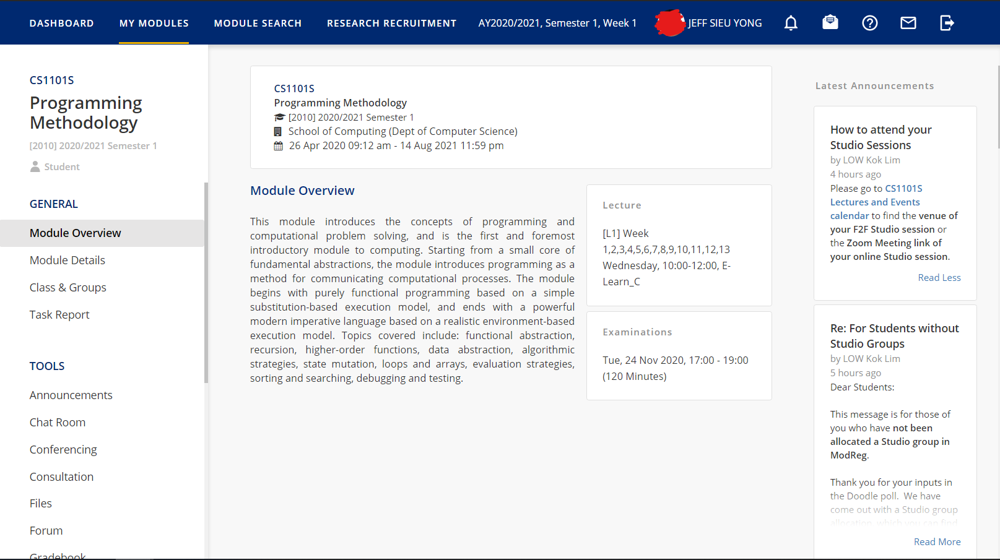

# LumiNUS Cleanup

The LumiNUS interface is ok, but honestly it takes up too much vertical space just to display its logo on my already small laptop, and it has so much padding everywhere for some reason.

This stylesheet addressing this by cleaning up:
- Navigation bar
- Navigation bar icons
- Module information sidebar

## Before

## After

